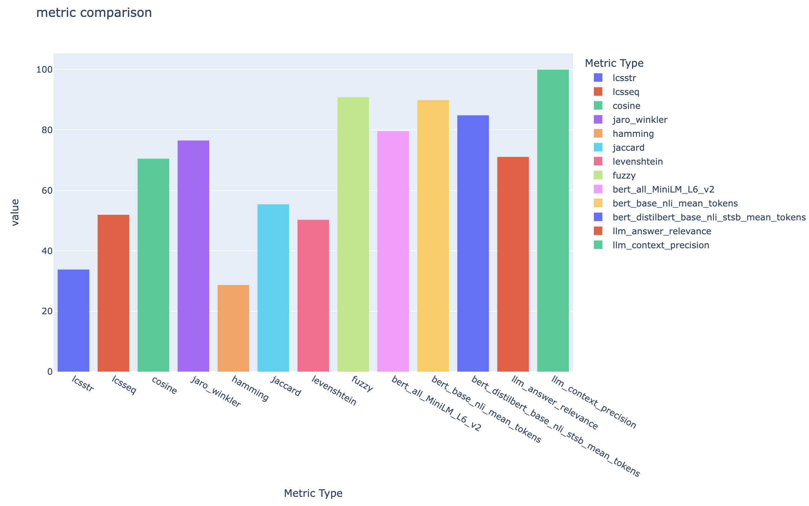
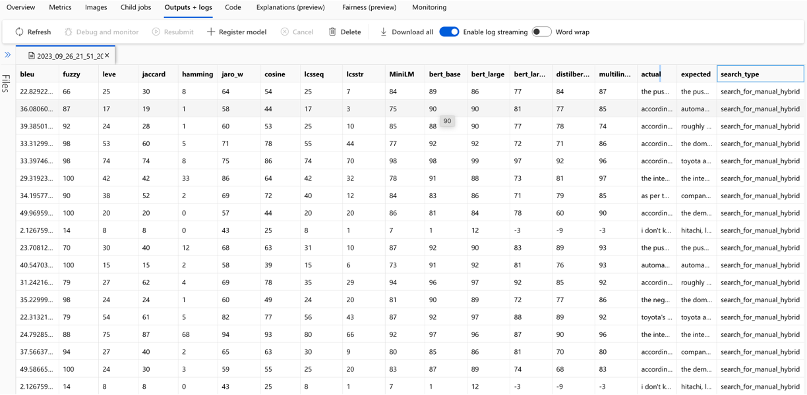
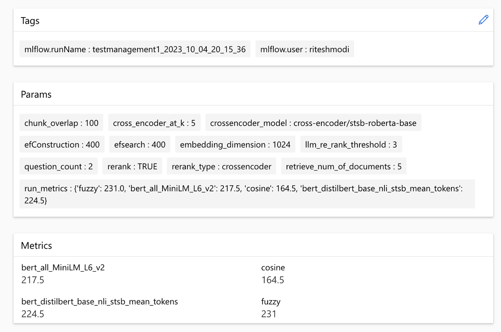
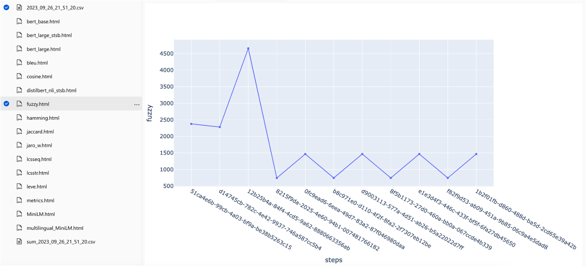
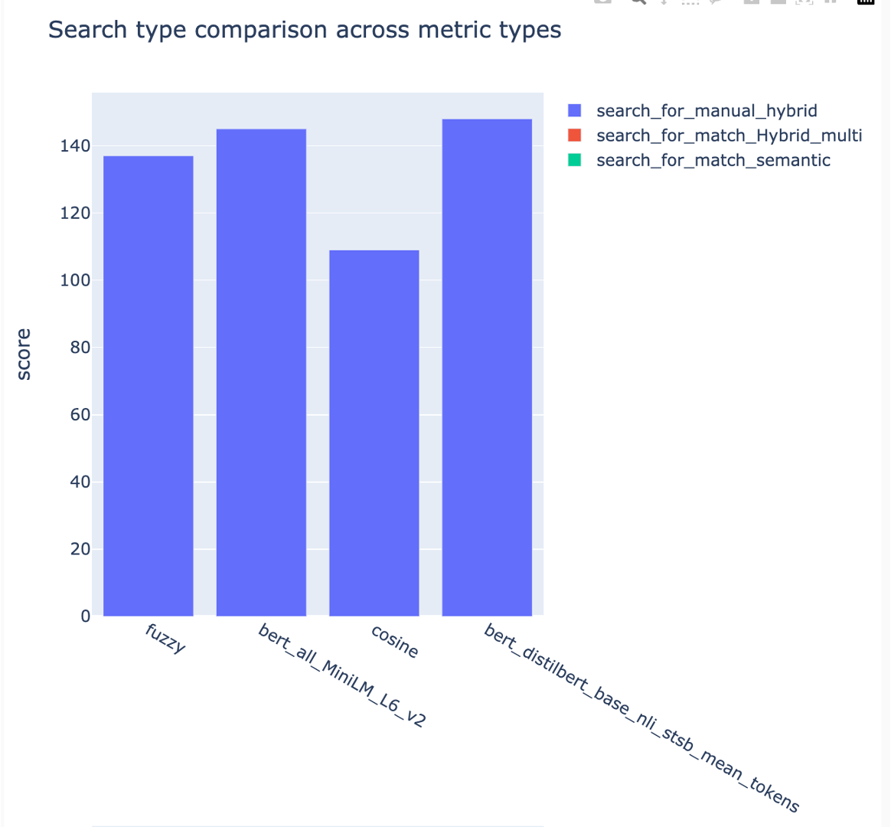

# RAG Experiment Accelerator

## Overview

The **RAG Experiment Accelerator** is a versatile tool that helps you conduct experiments and evaluations using Azure Cognitive Search and RAG pattern. This document provides a comprehensive guide that covers everything you need to know about this tool, such as its purpose, features, installation, usage, and more.

## Purpose

The main goal of the **RAG Experiment Accelerator** is to make it easier and faster to run experiments and evaluations of search queries and quality of response from OpenAI. This tool is useful for researchers, data scientists, and developers who want to:

- Test the performance of different Search and OpenAI related hyperparameters.
- Compare the effectiveness of various search strategies.
- Fine-tune and optimize parameters.
- Find the best combination of hyperparameters.
- Generate detailed reports and visualizations from experiment results.

## Features

The **RAG Experiment Accelerator** is config driven and offers a rich set of features to support its purpose:

1. **Experiment Setup**: You can define and configure experiments by specifying a range of search engine parameters, search types, query sets, and evaluation metrics.

2. **Integration**: It integrates seamlessly with Azure Cognitive Search, Azure Machine Learning, MLFlow and Azure OpenAI.

3. **Rich Search Index**: It creates multiple search indexes based on hyperparameter configurations available in the config file.

4. **Query Generation**: The tool can generate a variety of diverse and customizable query sets, which can be tailored for specific experimentation needs.

5. **Multiple Search Types**: It supports multiple search types, including pure text, pure vector, cross-vector, multi-vector, hybrid, and more. This gives you the ability to conduct comprehensive analysis on search capabilities and results.

6. **Sub-Querying**: The pattern evaluates the user query and if it finds it complex enough, it breaks it down into smaller sub-queries to generate relevant context.

7. **Re-Ranking**: The query responses from Azure Cognitive Search are re-evaluated using LLM and ranked according to the relevance between the query and the context.

8. **Metrics and Evaluation**: You can define custom evaluation metrics, which enable precise and granular assessment of search algorithm performance. It includes distance-based, cosine, semantic similarity, and more metrics out of the box.

9. **Report Generation**: The **RAG Experiment Accelerator** automates the process of report generation, complete with visually appealing visualizations that make it easy to analyze and share experiment findings.

10. **Multi-Lingual**: The tool supports language analyzers for linguistic support on individual languages and specialized (language-agnostic) analyzers for user-defined patterns on search indexes. For more information, see [Types of Analyzers](https://learn.microsoft.com/en-us/azure/search/search-analyzers#types-of-analyzers).


## Installation

To use the **RAG Experiment Accelerator**, follow these installation steps:

1. **Clone the repository**: Clone the accelerator's repository from [GitHub].

```bash
git clone https://github.com/microsoft/rag-experiment-accelerator.git
```

2. **setup env file**: Copy `.env.template` and save as `.env` file. Provide values for all the keys

LOGGING_LEVEL is INFO by default. Allowed logging levels are NOTSET, DEBUG, INFO, WARN, ERROR, CRITICAL.

3. Execute the requirements.txt in a conda (first install Anaconda/Miniconda) or virtual environment (then install a couple of dependencies - prompted on the run) to install the dependencies.

```bash
conda create -n rag-test python=3.10
conda activate rag-test
pip install .
```

4. Install Azure CLI and authorize:
```bash
az login
az account set  --subscription="<your_subscription_guid>"
az account show
```

5. Copy your files (in PDF, HTML, Markdown, Text, JSON or DOCX format) into the `data` folder.


## Pre-requisites

- [Azure Cognitive Search Service](https://learn.microsoft.com/en-us/azure/search/search-create-service-portal) (Note: [Semantic Search](https://learn.microsoft.com/en-us/azure/search/search-get-started-semantic?tabs=dotnet) is available in Azure Cognitive Search, at Basic tier or higher.)
- [Azure OpenAI Service](https://learn.microsoft.com/en-us/azure/ai-services/openai/overview#how-do-i-get-access-to-azure-openai) or access to the [OpenAI API](https://platform.openai.com/docs/quickstart?context=python)
- [Azure Machine Learning Resources](https://learn.microsoft.com/en-us/azure/machine-learning/tutorial-azure-ml-in-a-day?view=azureml-api-2)


## How to use

To use the **RAG Experiment Accelerator**, follow these steps:

1. Modify the `config.json` file with the hyperparameters for your experiment.
2. Run `01_index.py` (python 01_index.py) to create Azure Cognitive Search indexes and load data into them.
3. Run `02_qa_generation.py` (python 02_qa_generation.py) to generate question-answer pairs using Azure OpenAI.
4. Run `03_querying.py` (python 03_querying.py) to query Azure Cognitive Search to generate context, re-rank items in context, and get response from Azure OpenAI using the new context. 
5. Run `04_evaluation.py` (python 04_evaluation.py) to calculate metrics using various methods and generate charts and reports in Azure Machine Learning using MLFlow integration.


# Description of configuration elements

```json
{
    "name_prefix": "Name of experiment, search index name used for tracking and comparing jobs",
    "chunking": {
        "chunk_size": "Size of each chunk e.g. [500, 1000, 2000]" ,
        "overlap_size": "Overlap Size for each chunk e.g. [100, 200, 300]" 
    },
    "embedding_models": "see 'Description of embedding models config' below",
    "embedding_dimension" : "embedding size for each chunk e.g. [384, 1024]. Valid values are 384, 768,1024" ,
    "ef_construction" : "ef_construction value determines the value of Azure Cognitive Search vector configuration." ,
    "ef_search":  "ef_search value determines the value of Azure Cognitive Search vector configuration.",
    "language": {
        "analyzer_name" : "name of the analyzer to use for the field. This option can be used only with searchable fields and it can't be set together with either searchAnalyzer or indexAnalyzer.",
        "index_analyzer_name" : "name of the analyzer used at indexing time for the field. This option can be used only with searchable fields. It must be set together with searchAnalyzer and it cannot be set together with the analyzer option.",
        "search_analyzer_name" : "name of the analyzer used at search time for the field. This option can be used only with searchable fields. It must be set together with indexAnalyzer and it cannot be set together with the analyzer option. This property cannot be set to the name of a language analyzer; use the analyzer property instead if you need a language analyzer.",
    },
    "rerank": "determines if search results should be re-ranked. Value values are TRUE or FALSE" ,
    "rerank_type": "determines the type of re-ranking. Value values are llm or crossencoder", 
    "llm_re_rank_threshold": "determines the threshold when using llm re-ranking. Chunks with rank above this number are selected in range from 1 - 10." ,
    "cross_encoder_at_k": "determines the threshold when using cross-encoding re-ranking. Chunks with given rank value are selected." ,
    "crossencoder_model" :"determines the model used for cross-encoding re-ranking step. Valid value is cross-encoder/stsb-roberta-base",
    "search_types" : "determines the search types used for experimentation. Valid value are search_for_match_semantic, search_for_match_Hybrid_multi, search_for_match_Hybrid_cross, search_for_match_text, search_for_match_pure_vector, search_for_match_pure_vector_multi, search_for_match_pure_vector_cross, search_for_manual_hybrid. e.g. ['search_for_manual_hybrid', 'search_for_match_Hybrid_multi','search_for_match_semantic' ]",
    "retrieve_num_of_documents": "determines the number of chunks to retrieve from the search index",
    "metric_types" : "determines the metrics used for evaluation purpose. Valid value are lcsstr, lcsseq, cosine, jaro_winkler, hamming, jaccard, levenshtein, fuzzy, bert_all_MiniLM_L6_v2, bert_base_nli_mean_tokens, bert_large_nli_mean_tokens, bert_large_nli_stsb_mean_tokens, bert_distilbert_base_nli_stsb_mean_tokens, bert_paraphrase_multilingual_MiniLM_L12_v2, llm_answer_relevance, llm_context_precision. e.g ['fuzzy','bert_all_MiniLM_L6_v2','cosine','bert_distilbert_base_nli_stsb_mean_tokens']",
    "azure_oai_chat_deployment_name":  "determines the Azure OpenAI deployment name",
    "embedding_model_name": "embedding model name",
    "openai_temperature": "determines the OpenAI temperature. Valid value ranges from 0 to 1.",
    "search_relevancy_threshold": "the similarity threshold to determine if a doc is relevant. Valid ranges are from 0.0 to 1.0"
}
```

## Description of embedding models config

`embedding_models` is an array containing the configuration for the embedding models to use. Embedding model `type` must be `azure` for Azure OpenAI models and `sentence-transformer` for HuggingFace sentence trasnformer models.

### Azure OpenAI embedding model conifg

```json
    {
        "type": "azure", 
        "deployment_name": "the deployment name of the model",
        "dimension": "the dimesion of the embedding model. Defaults to 1536 which is the dimension of text-embedding-ada-002"
    },
```

### Sentence Transformer embedding model

```json
        {
            "type": "sentence-transformer",
            "model_name": "the name of the sentence transformer model",
            "dimension": "the dimension of the model. This field is not required if model name is one of ['all-MiniLM-L6-v2', 'all-mpnet-base-v2', 'bert-large-nli-mean-tokens]"
        }
```
## Reports

The solution integrates with Azure Machine Learning and uses MLFlow to manage experiments, jobs, and artifacts. You can view the following reports as part of the evaluation process:

### Metric Comparison



### Metric Analysis



### Hyper Parameters



### Sample Metrics



### Search evaluation




## Contributing

We welcome your contributions and suggestions. To contribute, you need to agree to a
Contributor License Agreement (CLA) that confirms you have the right to, and actually do, grant us
the rights to use your contribution. For details, visit [https://cla.opensource.microsoft.com].

When you submit a pull request, a CLA bot will automatically check whether you need to provide
a CLA and give you instructions (for example, status check, comment). Follow the instructions
from the bot. You only need to do this once for all repos that use our CLA.

Before you contribute, make sure to run

```
pip install -e .
pre-commit install
```

This project follows the [Microsoft Open Source Code of Conduct](https://opensource.microsoft.com/codeofconduct/).
For more information, see the [Code of Conduct FAQ](https://opensource.microsoft.com/codeofconduct/faq/) or
contact [opencode@microsoft.com](mailto:opencode@microsoft.com) with any questions or comments.

### Developer Contribution Guidelines

- **Branch Naming Convention**: 
    - Use the GitHub UI to include a tag in the branch name, then create the branch directly from the UI. Here are some examples:
        - `bug/11-short-description`
        - `feature/22-short-description`
- **Merging Changes**: 
    - When merging, squash your commits to have up to 3 incremental commits for Pull Requests (PRs) and merges.
    - Project maintainers can merge accepted code changes from contributors or contributors can request Write Permissions to the repo to merge a pull request once it has been reviewed by project maintainers.
    - Project Maintainers can be contacted via [email](ISE_AI_PLATFORM_TD@microsoft.com).
- **Branch Hygiene**: 
    - Delete the branch after it has been merged.
- **Testing Changes Locally**: 
    - Before merging, test your changes locally.
- **Naming Conventions**: 
    - Use snake case for metric names and configuration variables, like `example_snake_case`.
    - Set up your Git username to be your first and last name, like this: `git config --global user.name "First Last"`
- **Issue Tracking**:
    - Working on a contribution to the RAG Experiment Accelerator? Before opening a new issue, make sure to check if the feature has already been requested by searching for it in the associated [project issue tracker](https://github.com/orgs/microsoft/projects/991), and consider adding to that discussion instead. Otherwise, please open an issue for it using the feature request template or create a PR and make sure it is associated to the [project](https://github.com/orgs/microsoft/projects/991).


## Trademarks

This project might contain trademarks or logos for projects, products, or services. You must follow [Microsoft's Trademark & Brand Guidelines](https://www.microsoft.com/en-us/legal/intellectualproperty/trademarks/usage/general) to use Microsoft 
trademarks or logos correctly.
Don't use Microsoft trademarks or logos in modified versions of this project in a way that causes confusion or implies Microsoft sponsorship.
Follow the policies of any third-party trademarks or logos that this project contains.
