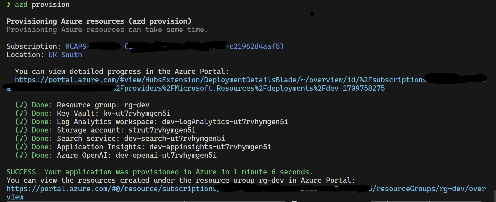
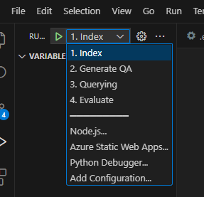
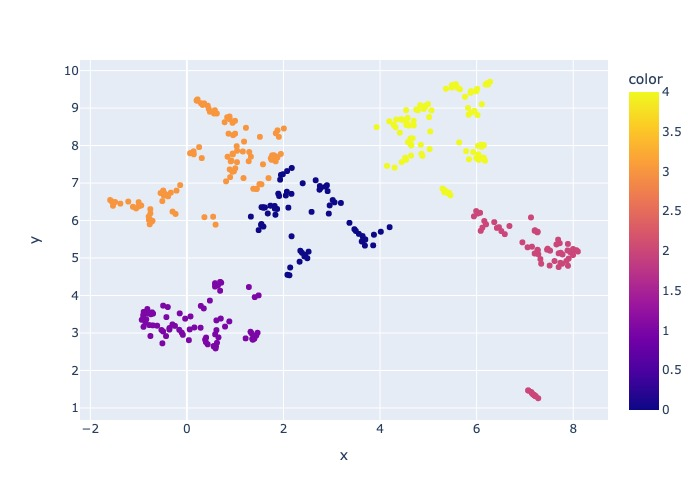
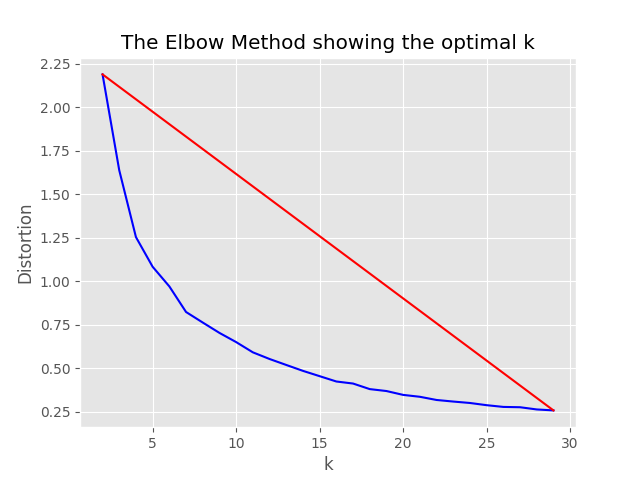
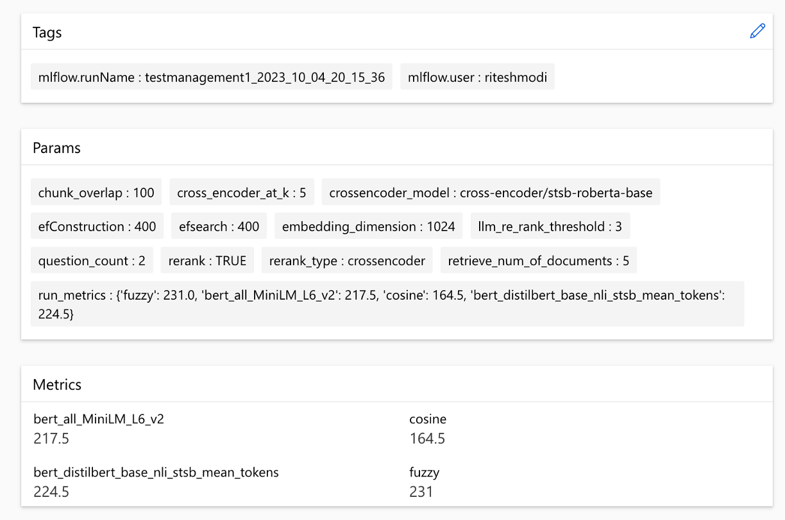
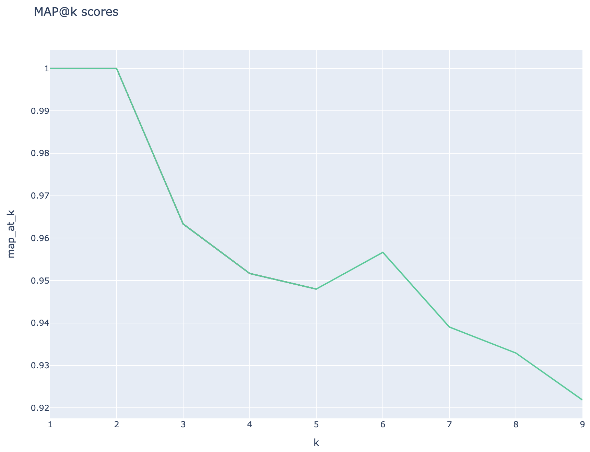
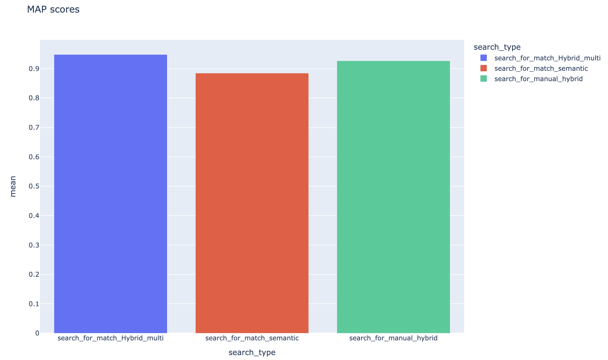

# RAG Experiment Accelerator

## Overview

The **RAG Experiment Accelerator** is a versatile tool that helps you conduct experiments and evaluations using Azure AI Search and RAG pattern. This document provides a comprehensive guide that covers everything you need to know about this tool, such as its purpose, features, installation, usage, and more.

## Purpose

The main goal of the **RAG Experiment Accelerator** is to make it easier and faster to run experiments and evaluations of search queries and quality of response from OpenAI. This tool is useful for researchers, data scientists, and developers who want to:

- Test the performance of different Search and OpenAI related hyperparameters.
- Compare the effectiveness of various search strategies.
- Fine-tune and optimize parameters.
- Find the best combination of hyperparameters.
- Generate detailed reports and visualizations from experiment results.

## Latest changes

18 March 2024: Content sampling has been added. This functionality will allow the dataset to be sampled by a specified percentage. The data is clustered by content and then the sample percentage is taken across each cluster to attempt even distribution of the sampled data.

This is done to ensure representative results in the sample that one would get across the entire dataset.

**Note**: It is recommended to rebuild your environment if you have used this tool before due to new dependencies.

## Features

The **RAG Experiment Accelerator** is config driven and offers a rich set of features to support its purpose:

1. **Experiment Setup**: You can define and configure experiments by specifying a range of search engine parameters, search types, query sets, and evaluation metrics.

1. **Integration**: It integrates seamlessly with Azure AI Search, Azure Machine Learning, MLFlow and Azure OpenAI.

1. **Rich Search Index**: It creates multiple search indexes based on hyperparameter configurations available in the config file.

1. **Multiple Document Loaders**: The tool supports multiple document loaders, including loading via Azure Document Intelligence and basic LangChain loaders. This gives you the flexibility to experiment with different extraction methods and evaluate their effectiveness.

1. **Custom Document Intelligence Loader**: When selecting the 'prebuilt-layout' API model for Document Intelligence, the tool utilizes a custom Document Intelligence loader to load the data. This custom loader supports formatting of tables with column headers into key-value pairs (to enhance readability for the LLM), excludes irrelevant parts of the file for the LLM (such as page numbers and footers), removes recurring patterns in the file using regex, and more. Since each table row is transformed into a text line, to avoid breaking a row in the middle, chunking is done recursively by paragraph and line.
The custom loader resorts to the simpler 'prebuilt-layout' API model as a fallback when the 'prebuilt-layout' fails. Any other API model will utilize LangChain's implementation, which returns the raw response from Document Intelligence's API.

1. **Query Generation**: The tool can generate a variety of diverse and customizable query sets, which can be tailored for specific experimentation needs.

1. **Multiple Search Types**: It supports multiple search types, including pure text, pure vector, cross-vector, multi-vector, hybrid, and more. This gives you the ability to conduct comprehensive analysis on search capabilities and results.

1. **Sub-Querying**: The pattern evaluates the user query and if it finds it complex enough, it breaks it down into smaller sub-queries to generate relevant context.

1. **Re-Ranking**: The query responses from Azure AI Search are re-evaluated using LLM and ranked according to the relevance between the query and the context.

1. **Metrics and Evaluation**: It supports end-to-end metrics comparing the generated answers (actual) against the ground-truth answers (expected), including distance-based, cosine and semantic similarity metrics. It also includes component-based metrics to assess retrieval and generation performance using LLMs as judges, such as context recall or answer relevance, as well as retrieval metrics to assess search results (e.g. MAP@k).

1. **Report Generation**: The **RAG Experiment Accelerator** automates the process of report generation, complete with visualizations that make it easy to analyze and share experiment findings.

1. **Multi-Lingual**: The tool supports language analyzers for linguistic support on individual languages and specialized (language-agnostic) analyzers for user-defined patterns on search indexes. For more information, see [Types of Analyzers](https://learn.microsoft.com/en-us/azure/search/search-analyzers#types-of-analyzers).

1. **Sampling**: If you have a large dataset and/or want to speed up the experimentation, a sampling process is available to create a small but representative sample of the data for the percentage specified. The data will be clustered by content and a percentage of each cluster will be selected as part of the sample. Results obtained should be roughly indicative of the full dataset within a ~10% margin. Once an approach has been identified, running on the full dataset is recommended for accurate results.

## Products used

- [Azure AI Search Service](https://learn.microsoft.com/en-us/azure/search/search-create-service-portal) (Note: [Semantic Search](https://learn.microsoft.com/en-us/azure/search/search-get-started-semantic?tabs=dotnet) is available in Azure AI Search, at Basic tier or higher.)
- [Azure OpenAI Service](https://learn.microsoft.com/en-us/azure/ai-services/openai/overview#how-do-i-get-access-to-azure-openai) or access to the [OpenAI API](https://platform.openai.com/docs/quickstart?context=python)
- [Azure Machine Learning Resources](https://learn.microsoft.com/en-us/azure/machine-learning/tutorial-azure-ml-in-a-day?view=azureml-api-2)

## Compute setup

At the moment, the RAG Experiment Accelerator can be run locally leveraging one of the following:

* [Run within a development container](#1-run-within-a-development-container)
* [Install locally on your host machine](#2-local-install).

### 1. Run within a Development Container

Using a development container will mean that all of the required software is installed for you. This will require WSL. For more information about development containers visit [containers.dev](https://containers.dev/)

#### Install the Pre-Requisite Software

Install the following software on the host machine you will perform the deployment from:

>1. For Windows - [Windows Store Ubuntu 22.04.3 LTS](https://www.microsoft.com/store/productId/9pn20msr04dw)
>2. [Docker Desktop](https://www.docker.com/products/docker-desktop)
>3. [Visual Studio Code](https://visualstudio.microsoft.com/downloads/)
>4. [VS Code Extension: Remote-Containers](vscode:extension/ms-vscode-remote.remote-containers)

#### Developing in a DevContainer

Further guidance of setting up WSL can be found [here](./docs/wsl.md). Now you have the prerequisites, you can:
1. **Clone the repository**: Clone the accelerator's repository in your WSL terminal.

```bash
git clone https://github.com/microsoft/rag-experiment-accelerator.git
code .
```

Once the project opens in vscode it should ask you if you would like to "Reopen this in a development container". Say yes.

---

### 2. Local install

You can of course run the **RAG Experiment Accelerator** on a Windows/Mac machine if you like; you are responsible for installing the correct tooling. Follow these installation steps:

1. **Clone the repository**: Clone the accelerator's repository from [GitHub].

```bash
git clone https://github.com/microsoft/rag-experiment-accelerator.git
```

2. Execute the requirements.txt in a conda (first install Anaconda/Miniconda) or virtual environment (then install a couple of dependencies - prompted on the run) to install the dependencies.

```bash
conda create -n rag-experiment python=3.11
conda init bash
```
Close your terminal, open a new one, and run:
```bash
conda activate rag-experiment
pip install .
```

3. Install Azure CLI and authorize:
```bash
az login
az account set  --subscription="<your_subscription_guid>"
az account show
```

## Provision Infrastructure

There are 3 options to install all the required azure services:

### 1. Install with Azure Developer CLI
This project supports Azure Developer CLI.
```sh
azd provision
```
- You can also use `azd up` if you prefer as this calls `azd provision` anyway
- Please use the up/down arrows to select your Subscription and Region



Once this has completed you can use the launch configuration to run, or debug the 4 steps and the current environment provisioned by `azd` will be loaded with the correct values.



### 2. One click Azure deployment via Azure portal UI

If you want to deploy the infrastructure yourself from template you can also click here:

[](https://portal.azure.com/#create/Microsoft.Template/uri/https%3A%2F%2Fraw.githubusercontent.com%2Fmicrosoft%2Frag-experiment-accelerator%2Fdevelopment%2Finfra%2Fmain.json)

### 3. Deploy with Azure CLI

If you don't want to use `azd` you can use the normal `az` cli too.

Use following command to deploy.

```bash
az login
az deployment sub create --subscription <subscription-id> --location <location>  --template-file infra/main.bicep
```

Or

To deploy with isolated network use following command. Replace the parameter values with the specifics of your isolated network. You **must** supply all three parameters (i.e. `vnetAddressSpace`, `proxySubnetAddressSpace` and `subnetAddressSpace`) if you wish to deploy to an isolated network.

```bash
az login
az deployment sub create --location <location> --template-file infra/main.bicep \
--parameters vnetAddressSpace=<vnet-address-space> \
--parameters proxySubnetAddressSpace=<proxy-subnet-address-space> \
--parameters subnetAddressSpace=<azure-subnet-address-space>
```

here is an example with parameter values:

```bash
az deployment sub create --location uksouth --template-file infra/main.bicep \
--parameters vnetAddressSpace='10.0.0.0/16' \
--parameters proxySubnetAddressSpace='10.0.1.0/24' \
--parameters subnetAddressSpace='10.0.2.0/24'
```

## How to use

To use the **RAG Experiment Accelerator** locally, follow these steps:

1. Copy the provided `.env.template` file to a file named `.env` and update all of the [required values](./docs/environment-variables.md). Many of the required values for the `.env` file will come from resources which have previously been configured and/or can be gathered from resources provisioned in the [Provision Infrastructure](#provision-infrastructure) section. Also note, by default, `LOGGING_LEVEL` is set to `INFO` but can be changed to any of the following levels: `NOTSET`, `DEBUG`, `INFO`, `WARN`, `ERROR`, `CRITICAL`.
    ```bash
    cp .env.template .env
    # change parameters manually
    ```
1. Copy the provided `config.sample.json` file to a file named `config.json` and change any hyperparameters to tailor to your experiment.
    ```bash
    cp config.sample.json config.json
    # change parameters manually
    ```
1. Copy any files for ingestion (PDF, HTML, Markdown, Text, JSON or DOCX format) into the `data` folder.

1. Run `01_index.py` (python 01_index.py) to create Azure AI Search indexes and load data into them.
    ```bash
    python 01_index.py
    -d "The directory holding the configuration files and data. Defaults to current working directory"
    -dd "The directory holding the data. Defaults to data"
    -cf "JSON config filename. Defaults to config.json"
    ```
1. Run `02_qa_generation.py` (python 02_qa_generation.py) to generate question-answer pairs using Azure OpenAI.
    ```bash
    python 02_qa_generation.py
    -d "The directory holding the configuration files and data. Defaults to current working directory"
    -dd "The directory holding the data. Defaults to data"
    -cf "JSON config filename. Defaults to config.json"
    ```
1. Run `03_querying.py` (python 03_querying.py) to query Azure AI Search to generate context, re-rank items in context, and get response from Azure OpenAI using the new context.
    ```bash
    python 03_querying.py
    -d "The directory holding the configuration files and data. Defaults to current working directory"
    -cf "JSON config filename. Defaults to config.json"
    ```
1. Run `04_evaluation.py` (python 04_evaluation.py) to calculate metrics using various methods and generate charts and reports in Azure Machine Learning using MLFlow integration.
    ```bash
    python 04_evaluation.py
    -d "The directory holding the configuration files and data. Defaults to current working directory"
    -cf "JSON config filename. Defaults to config.json"
    ```

Alternatively, you can run the above steps (apart from `02_qa_generation.py`) using an Azure ML pipeline. To do so, follow [the guide here](./docs/azureml-pipeline.md).

### Running with sampling

Sampling will be run locally to create a small but representative slice of the data. This helps with rapid experimentation and keeps costs down. Results obtained should be roughly indicative of the full dataset within a ~10% margin. Once an approach has been identified, running on the full dataset is recommended for accurate results.

**Note**: Sampling can only be run locally, at this stage it is not supported on a distributed AML compute cluster. So the process would be to run sampling locally and then use the generated sample dataset to run on AML.

If you have a very large dataset and want to run a similar approach to sample the data, you can use the pyspark in-memory distributed implementation in the [Data Discovery Toolkit](https://github.com/microsoft/Data-Discovery-Toolkit) for [Microsoft Fabric](https://learn.microsoft.com/en-us/fabric/get-started/microsoft-fabric-overview) or [Azure Synapse Analytics](https://learn.microsoft.com/en-gb/azure/synapse-analytics/).

#### Available sampling parameters in the config.json file

```json
    "sampling": {
        "sample_data": "Set to true to enable sampling",
        "only_run_sampling": "If set to true, this will only run the sampling step and will not create an index or any subsequent steps, use this if you want to build a small sampled dataset to run in AML",
        "sample_percentage": "Percentage of the document corpus to sample",
        "optimum_k": "Set to 'auto' to automatically determine the optimum cluster number or set to a specific value e.g. 15",
        "min_cluster": "Used by the automated optimum cluster process, this is the minimum number of clusters e.g. 2",
        "max_cluster": "Used by the automated optimum cluster process, this is the maximum number of clusters e.g. 30",
    },
```


The sampling process will produce the following artifacts in the sampling directory:

1. A directory named after the config value ```job_name``` containing the subset of files sampled, these can be specified as ```--data_dir``` argument when running the entire process on AML.
2. A 2 dimensional scatter plot of the clustered files (by content) selected as the sampled dataset in the sampling folder.

3. A .cvs file of the entire dataset with cluster predictions named "all_cluster_predictions..." and a cvs file with the sampled cluster predictions named "sampled_cluster_predictions...". This can be used for further enriching the dataset, for example, creating a meaningful label per cluster and updates all record. See the [Heuristics classifier in the Data Discovery Toolkit as an example](https://github.com/microsoft/Data-Discovery-Toolkit/blob/main/walkthroughs/heuristics/standalone_text_heuristics.ipynb) or [Pixplotml for image data](https://github.com/microsoft/Data-Discovery-Toolkit?tab=readme-ov-file#using-pixplotml-to-rapidly-visualise-and-label-data-for-training).
4. If the ```"optimum_k": auto``` config value is set to auto, the sampling process will attempt to set the optimum number of clusters automatically. This can be overridden if you know roughly how many broad buckets of content exist in your data. An elbow graph will be generated in the sampling folder.


Two options exist for running sampling, namely:

1. Run the entire process locally with sampling, including the index generation and subsequent steps
2. Run only the sampling locally and then use the created sampled dataset to execute on AML

#### Run the entire process locally

Set the following values to run the indexing process locally:

```json
    "sampling": {
        "sample_data": true,
        "only_run_sampling": false,
        "sample_percentage": 10,
        "optimum_k": auto,
        "min_cluster": 2,
        "max_cluster": 30
    },
```

#### Run only the sampling locally and the subsequent steps on AML

If ```only_run_sampling```config value is set to true, this will only run the sampling step, no index will be created and any other subsequent steps will not executed. Set the ```--data_dir``` argument to directory created by the sampling process which will be:

```artifacts/sampling/config.[job_name]``` and execute the [AML pipeline step.](docs/azureml-pipeline.md)

# Description of configuration elements

All the values can be lists of elements. Including the nested configurations.
Every array will produce the combinations of flat configurations when the method `flatten()` is called on a particular node, to select 1 random combination - call the method `sample()`.

```json
{
    "experiment_name": "If provided, this will be the experiment name in Azure ML and it will group all job run under the same experiment, otherwise (if left empty) index_name_prefix will be used and there may be more than one experiment",
    "job_name": "If provided, all jobs runs in Azure ML will be named with this property value plus timestamp, otherwise (if left empty) each job with be named only with timestamp",
    "job_description": "You may provide a description for the current job run which describes in words what you are about to experiment with",
    "data_formats": "Specifies the supported data formats for the application. You can choose from a variety of formats such as JSON, CSV, PDF, and more. [*] - means all formats included",
    "main_instruction": "Defines the main instruction prompt coming with queries to LLM",
    "use_checkpoints": "A boolean. If true, enables use of checkpoints to load data and skip processing that was already done in previous executions.",
    "index": {
        "index_name_prefix": "Search index name prefix",
        "ef_construction": "ef_construction value determines the value of Azure AI Search vector configuration.",
        "ef_search": "ef_search value determines the value of Azure AI Search vector configuration.",
        "chunking": {
            "preprocess": "A boolean. If true, preprocess documents, split into smaller chunks, embed and enrich them, and finally upload documents chunks for retrieval into Azure Search Index.",
            "chunk_size": "Size of each chunk e.g. [500, 1000, 2000]",
            "overlap_size": "Overlap Size for each chunk e.g. [100, 200, 300]",
            "generate_title": "A boolean. If true, a title is generated for the chunk of content and an embedding is created for it",
            "generate_summary": "A boolean. If true, a summary is generated for the chunk of content and an embedding is created for it",
            "override_content_with_summary": "A boolean. If true, The chunk content is replaced with its summary",
            "chunking_strategy": "determines the chunking strategy. Valid values are 'azure-document-intelligence' or 'basic'",
            "azure_document_intelligence_model": "represents the Azure Document Intelligence Model. Used when chunking strategy is 'azure-document-intelligence'. When set to 'prebuilt-layout', provides additional features (see above)"
        },
        "embedding_model": "see 'Description of embedding models config' below",
        "sampling": {
            "sample_data": "Set to true to enable sampling",
            "percentage": "Percentage of the document corpus to sample",
            "optimum_k": "Set to 'auto' to automatically determine the optimum cluster number or set to a specific value e.g. 15",
            "min_cluster": "Used by the automated optimum cluster process, this is the minimum number of clusters e.g. 2",
            "max_cluster": "Used by the automated optimum cluster process, this is the maximum number of clusters e.g. 30"
        }
    },
    "language": {
        "analyzer": {
            "analyzer_name": "name of the analyzer to use for the field. This option can be used only with searchable fields and it can't be set together with either searchAnalyzer or indexAnalyzer.",
            "index_analyzer_name": "name of the analyzer used at indexing time for the field. This option can be used only with searchable fields. It must be set together with searchAnalyzer and it cannot be set together with the analyzer option.",
            "search_analyzer_name": "name of the analyzer used at search time for the field. This option can be used only with searchable fields. It must be set together with indexAnalyzer and it cannot be set together with the analyzer option. This property cannot be set to the name of a language analyzer; use the analyzer property instead if you need a language analyzer.",
            "char_filters": "The character filters for the index",
            "tokenizers": "The tokenizers for the index",
            "token_filters": "The token filters for the index"
        },
        "query_language": "The language of the query. Possible values: en-us, en-gb, fr-fr etc."
    },
    "rerank": {
        "enabled": "determines if search results should be re-ranked. Value values are TRUE or FALSE",
        "type": "determines the type of re-ranking. Value values are llm or cross_encoder",
        "llm_rerank_threshold": "determines the threshold when using llm re-ranking. Chunks with rank above this number are selected in range from 1 - 10.",
        "cross_encoder_at_k": "determines the threshold when using cross-encoding re-ranking. Chunks with given rank value are selected.",
        "cross_encoder_model": "determines the model used for cross-encoding re-ranking step. Valid value is cross-encoder/stsb-roberta-base"
    },
    "search": {
        "retrieve_num_of_documents": "determines the number of chunks to retrieve from the search index",
        "search_type": "determines the search types used for experimentation. Valid value are search_for_match_semantic, search_for_match_Hybrid_multi, search_for_match_Hybrid_cross, search_for_match_text, search_for_match_pure_vector, search_for_match_pure_vector_multi, search_for_match_pure_vector_cross, search_for_manual_hybrid. e.g. ['search_for_manual_hybrid', 'search_for_match_Hybrid_multi','search_for_match_semantic']",
        "search_relevancy_threshold": "the similarity threshold to determine if a doc is relevant. Valid ranges are from 0.0 to 1.0"
    },
    "query_expansion": {
        "expand_to_multiple_questions": "whether the system should expand a single question into multiple related questions. By enabling this feature, you can generate a set of alternative related questions that may improve the retrieval process and provide more accurate results".,
        "query_expansion": "determines if query expansion feature is on. Value values are TRUE or FALSE",
        "hyde": "this feature allows you to experiment with various query expansion approaches which may improve the retrieval metrics. The possible values are 'disabled' (default), 'generated_hypothetical_answer', 'generated_hypothetical_document_to_answer' reference article - Precise Zero-Shot Dense Retrieval without Relevance Labels (HyDE - Hypothetical Document Embeddings) - https://arxiv.org/abs/2212.10496",
        "min_query_expansion_related_question_similarity_score": "minimum similarity score in percentage between LLM generated related queries to the original query using cosine similarly score. default 90%"
    },
    "openai": {
        "azure_oai_chat_deployment_name": "determines the Azure OpenAI deployment name",
        "azure_oai_eval_deployment_name": "determines the Azure OpenAI deployment name used for evaluation",
        "temperature": "determines the OpenAI temperature. Valid value ranges from 0 to 1."
    },
    "eval": {
<<<<<<< HEAD
        "metric_types": "determines the metrics used for evaluation (end-to-end or component-wise metrics using LLMs). Valid values for end-to-end metrics are lcsstr, lcsseq, cosine, jaro_winkler, hamming, jaccard, levenshtein, fuzzy, bert_all_MiniLM_L6_v2, bert_base_nli_mean_tokens, bert_large_nli_mean_tokens, bert_large_nli_stsb_mean_tokens, bert_distilbert_base_nli_stsb_mean_tokens, bert_paraphrase_multilingual_MiniLM_L12_v2. Valid values for component-wise LLM-based metrics are ragas_answer_relevance, ragas_context_precision and ragas_context_recall. e.g ['fuzzy','bert_all_MiniLM_L6_v2','cosine','bert_distilbert_base_nli_stsb_mean_tokens', 'ragas_answer_relevance']",
=======
        "metric_types": "determines the metrics used for evaluation (end-to-end or component-wise metrics using LLMs). Valid values for end-to-end metrics are lcsstr, lcsseq, cosine, jaro_winkler, hamming, jaccard, levenshtein, fuzzy_score, cosine_ochiai, bert_all_MiniLM_L6_v2, bert_base_nli_mean_tokens, bert_large_nli_mean_tokens, bert_large_nli_stsb_mean_tokens, bert_distilbert_base_nli_stsb_mean_tokens, bert_paraphrase_multilingual_MiniLM_L12_v2. Valid values for component-wise LLM-based metrics are llm_answer_relevance, llm_context_precision and llm_context_recall. e.g ['fuzzy_score','bert_all_MiniLM_L6_v2','cosine_ochiai','bert_distilbert_base_nli_stsb_mean_tokens', 'llm_answer_relevance']",
>>>>>>> development
    }
}
```

> NOTE: When changing the config, remember to change:
- `config.sample.json` (the example config to be copied by others)
- [Github actions config file](.github/workflows/config.json) to be used by tests on CI
- [Unit tests config file](run/tests/data/config.json)

## Description of embedding models config

`embedding_model` is an array containing the configuration for the embedding models to use. Embedding model `type` must be `azure` for Azure OpenAI models and `sentence-transformer` for HuggingFace sentence transformer models.

### Azure OpenAI embedding model config

```json
{
    "type": "azure",
    "model_name": "the name of the Azure OpenAI model",
    "dimension": "the dimension of the embedding model. For example, 1536 which is the dimension of text-embedding-ada-002"
}
```

If you are using a model other than `text-embedding-ada-002`, you must specify the corresponding dimension for the model in the `dimension` field; for example:

```json
{
    "type": "azure",
    "model_name": "text-embedding-3-large",
    "dimension": 3072
}
```

The dimensions for the different Azure OpenAI embeddings models can be found in the [Azure OpenAI Service models](https://learn.microsoft.com/en-us/azure/ai-services/openai/concepts/models#embeddings-models) documentation.

When using the [newer embeddings models (v3)](https://openai.com/blog/new-embedding-models-and-api-updates), you can also leverage their support for shortening embeddings. In this case, specify the number of dimensions you require, and add the `shorten_dimensions` flag to indicate that you want to shorten the embeddings. For example:

```json
{
    "type": "azure",
    "model_name": "text-embedding-3-large",
    "dimension": 256,
    "shorten_dimensions": true
}
```

### Sentence Transformer embedding model

```json
{
    "type": "sentence-transformer",
    "model_name": "the name of the sentence transformer model",
    "dimension": "the dimension of the model. This field is not required if model name is one of ['all-MiniLM-L6-v2', 'all-mpnet-base-v2', 'bert-large-nli-mean-tokens]"
}
```

## Query Expansion

Giving an example of an hypothetical answer for the question in query, an hypothetical passage which holds an answer to the query, or generate few alternative related question might improve retrieval and thus get more accurate chunks of docs to pass into LLM context.
Based on the reference article - [Precise Zero-Shot Dense Retrieval without Relevance Labels (HyDE - Hypothetical Document Embeddings)](https://arxiv.org/abs/2212.10496).

The following configuration options turns on this experimentation approaches:


### Generate hypothetical answer for the question in query
```json
{
    "hyde": "generated_hypothetical_answer"
}
```

### Generate hypothetical document which includes an answer for the question in query
```json
{
    "hyde": "generated_hypothetical_document_to_answer"
}
```

### Generate related question for the question in query

This feature will generate fine related questions, filter out those which are less than `min_query_expansion_related_question_similarity_score` percent from the original query (using cosine similarity score), and search documents for each one of them along with the original query,
deduplicate results and return them to the reranker and top k steps.

default value for `min_query_expansion_related_question_similarity_score` is set to 90%, you may change this in the `config.json`

```json
{
    "query_expansion": true,
    "min_query_expansion_related_question_similarity_score": 90
}
```

## Reports

The solution integrates with Azure Machine Learning and uses MLFlow to manage experiments, jobs, and artifacts. You can view the following reports as part of the evaluation process:

### Metric Comparison
`all_metrics_current_run.html` shows average scores across questions and search types for each selected metric:


### Metric Analysis
The computation of each metric and fields used for evaluation are tracked for each question and search type in the output csv file:


### Hyper Parameters



### Sample Metrics
Metrics can be compared across runs:


### Search evaluation
Metrics can be compared across different search strategies:


### Retrieval evaluation
Mean average precision scores are tracked and average MAP scores can be compared across search type:




### Pitfalls

This section outlines common gotchas or pitfalls that engineers/developers/data scientists may encounter while working with RAG Experiment Accelerator.

#### Azure Authentication and Authorization

To successfully utilize this solution, you must first authenticate yourself by logging in to your Azure account. This essential step ensures you have the required permissions to access and manage Azure resources used by it. You might errors related to storing QnA data into Azure Machine Learning Data Assets, executing the query and evaluation step as a result of inappropriate authorization and authentication to Azure. Refer to Point 4 in this document for authentication and authorization.

There might be situations in which the solution would still generate errors despite of valid authentication and authorization. In such cases, start a new session with a brand new terminal instance, login to Azure using steps mentioned in step 4 and also check if the user has contribute access to the Azure resources related to the solution.

#### Configuration

This solution utilizes several configuration parameters in `config.json` that directly impact its functionality and performance. Please pay close attention to these settings:

**retrieve_num_of_documents:** This config controls the initial number of documents retrieved for analysis. Excessively high or low values can lead to "index out of range" errors due to rank processing of Search AI results.

**cross_encoder_at_k:** This config influences the ranking process. A high value might result in irrelevant documents being included in the final results.

**llm_rerank_threshold:** This config determines which documents are passed to the language model (LLM) for further processing. Setting this value too high could create an overly large context for the LLM to handle, potentially leading to processing errors or degraded results. This might also result in exception from Azure OpenAI endpoint.

#### Azure OpenAI Model and Deployment

Before running this solution, please ensure you've correctly set up both your Azure OpenAI deployment name within config.json file and add relevant secrets to environment variables (.env file). This information is crucial for the application to connect to the appropriate Azure OpenAI resources and function as designed. If you're unsure about the configuration data, please refer to .env.template and config.json file. The solution has been tested with GPT 3.5 turbo model and needs further tests for any other model.

#### QnA Generation and Querying step

During the QnA generation step, you may occasionally encounter errors related to the JSON output received from Azure OpenAI. These errors can prevent the successful generation of few questions and answers. Here's what you need to know:

##### Possible Causes:

**Incorrect Formatting:** The JSON output from Azure OpenAI may not adhere to the expected format, causing issues with the QnA generation process.
**Content Filtering:** Azure OpenAI has content filters in place. If the input text or generated responses are deemed inappropriate, it could lead to errors.
**API Limitations:** The Azure OpenAI service have token and rate limitations that affect the output.

#### Evaluation step

**End-to-end evaluation metrics:** not all the metrics comparing the generated and ground-truth answers are able to capture differences in semantics. For example, metrics such as `levenshtein` or `jaro_winkler` only measure edit distances. The `cosine` metric doesn't allow the comparison of semantics either: it uses the *textdistance* token-based implementation based on term frequency vectors. To calculate the semantic similarity between the generated answers and the expected responses, consider using embedding-based metrics such as Bert scores (`bert_`).

**Component-wise evaluation metrics:** evaluation metrics using LLM-as-judges aren't deterministic. The `llm_` metrics included in the accelerator use the model indicated in the `azure_oai_eval_deployment_name` config field. The prompts used for evaluation instruction can be adjusted and are included in the `prompts.py` file (`ragas_answer_relevance_instruction`, `ragas_context_recall_instruction`, `ragas_context_precision_instruction`).

**Retrieval-based metrics:** MAP scores are computed by comparing each retrieved chunk against the question and the chunk used to generate the qna pair. To assess whether a retrieved chunk is relevant or not, the similarity between the retrieved chunk and the concatenation of the end user question and the chunk used in the qna step (`02_qa_generation.py`) is computed using the SpacyEvaluator. Spacy similarity defaults to the average of the token vectors, meaning that the computation is insensitive to the order of the words. By default, the similarity threshold is set to 80% (`spacy_evaluator.py`).

## Contributing

We welcome your contributions and suggestions. To contribute, you need to agree to a
Contributor License Agreement (CLA) that confirms you have the right to, and actually do, grant us
the rights to use your contribution. For details, visit [https://cla.opensource.microsoft.com].

When you submit a pull request, a CLA bot will automatically check whether you need to provide
a CLA and give you instructions (for example, status check, comment). Follow the instructions
from the bot. You only need to do this once for all repos that use our CLA.

Before you contribute, make sure to run

```
pip install -e .
pre-commit install
```

This project follows the [Microsoft Open Source Code of Conduct](https://opensource.microsoft.com/codeofconduct/).
For more information, see the [Code of Conduct FAQ](https://opensource.microsoft.com/codeofconduct/faq/) or
contact [opencode@microsoft.com](mailto:opencode@microsoft.com) with any questions or comments.

### Developer Contribution Guidelines

- **Branch Naming Convention**:
    - Use the GitHub UI to include a tag in the branch name, then create the branch directly from the UI. Here are some examples:
        - `bug/11-short-description`
        - `feature/22-short-description`
- **Merging Changes**:
    - When merging, squash your commits to have up to 3 incremental commits for Pull Requests (PRs) and merges.
    - Project maintainers can merge accepted code changes from contributors or contributors can request Write Permissions to the repo to merge a pull request once it has been reviewed by project maintainers.
    - Project Maintainers can be contacted via [email](ISE_AI_PLATFORM_TD@microsoft.com).
- **Branch Hygiene**:
    - Delete the branch after it has been merged.
- **Testing Changes Locally**:
    - Before merging, test your changes locally.
- **Naming Conventions**:
    - Use snake case for metric names and configuration variables, like `example_snake_case`.
    - Set up your Git username to be your first and last name, like this: `git config --global user.name "First Last"`
- **Issue Tracking**:
    - Working on a contribution to the RAG Experiment Accelerator? Before opening a new issue, make sure to check if the feature has already been requested by searching for it in the associated [project issue tracker](https://github.com/orgs/microsoft/projects/991), and consider adding to that discussion instead. Otherwise, please open an issue for it using the feature request template or create a PR and make sure it is associated to the [project](https://github.com/orgs/microsoft/projects/991).


## Trademarks

This project might contain trademarks or logos for projects, products, or services. You must follow [Microsoft's Trademark & Brand Guidelines](https://www.microsoft.com/en-us/legal/intellectualproperty/trademarks/usage/general) to use Microsoft
trademarks or logos correctly.
Don't use Microsoft trademarks or logos in modified versions of this project in a way that causes confusion or implies Microsoft sponsorship.
Follow the policies of any third-party trademarks or logos that this project contains.
