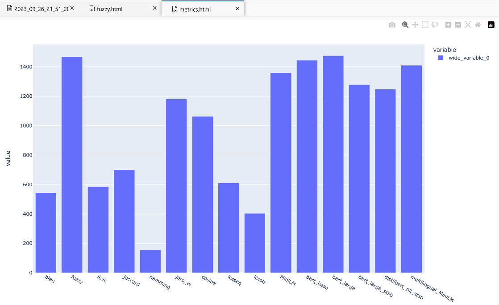
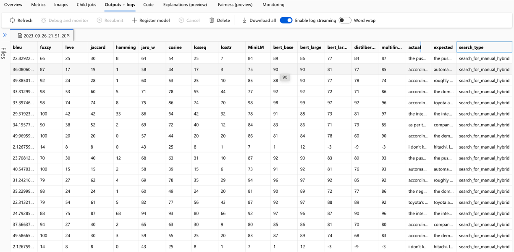
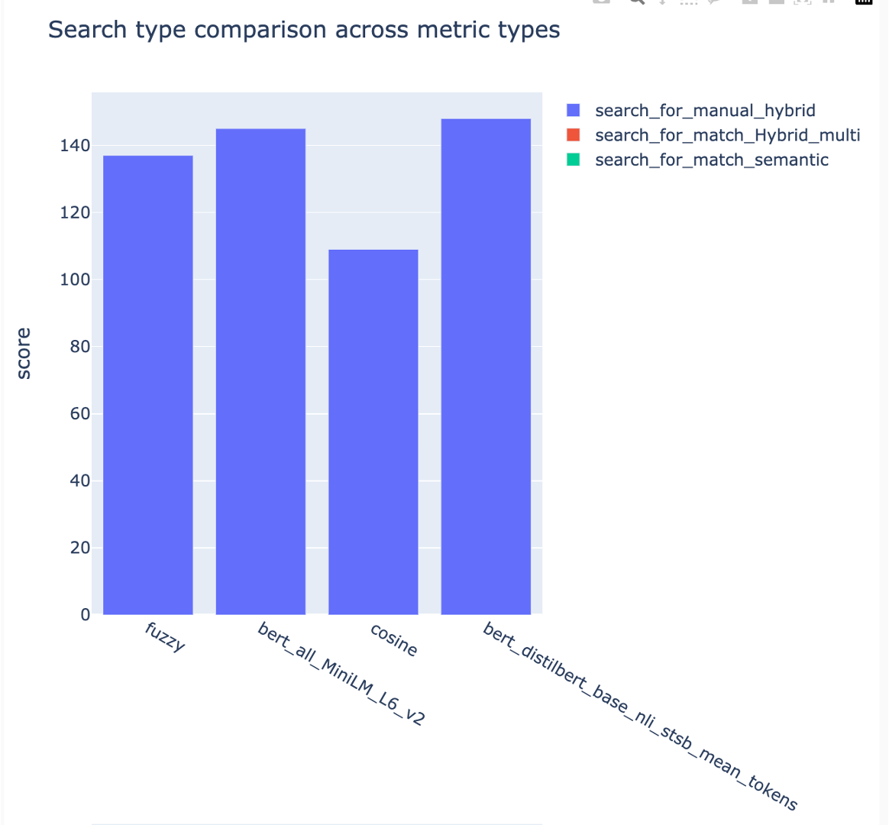

# RAG Experiment Accelerator Command-Line Sample

## Installation

To use the **RAG Experiment Accelerator**, follow these installation steps:

1. **Clone the repository**: Clone the accelerator's repository from [GitHub].

```bash
git clone https://github.com/microsoft/rag-experiment-accelerator.git
```

2. **setup env file**: Copy `.env.template` and save as `.env` file. Provide values for all the keys

LOGGING_LEVEL is INFO by default. Allowed logging levels are NOTSET, DEBUG, INFO, WARN, ERROR, CRITICAL.
OPENAI_API_TYPE should be either `azure` if you are planning to use Azure, `open_ai` if you want to use OpenAI.

3. Build rag-experiment-accelerator package in a conda (first install Anaconda/Miniconda) or virtual environment (then install a couple of dependencies - prompted on the run). After repo goes public and we publish the package, there will be no need to build the package locally. Runt eh following from the root of the project

```bash
conda create -n rag-test python=3.10
conda activate rag-test
python setup.py sdist
```

4. Install Azure CLI and authorize:
```bash
az login
az account set  --subscription="<your_subscription_guid>"
az account show
```

5. Copy your `.pdf` files into the `data` folder.

6. Install rag-experiment-accelerator package from the root of the project
```bash
pip install dist/rag-experiment-accelerator-1.0.0.tar.gz
```


## Pre-requisites

- [Azure Cognitive Search Service](https://learn.microsoft.com/en-us/azure/search/search-create-service-portal) (Note: [Semantic Search](https://learn.microsoft.com/en-us/azure/search/search-get-started-semantic?tabs=dotnet) is available in Azure Cognitive Search, at Basic tier or higher.)
- [Azure OpenAI Service](https://learn.microsoft.com/en-us/azure/ai-services/openai/overview#how-do-i-get-access-to-azure-openai) or access to the [OpenAI API](https://platform.openai.com/docs/quickstart?context=python)
- [Azure Machine Learning Resources](https://learn.microsoft.com/en-us/azure/machine-learning/tutorial-azure-ml-in-a-day?view=azureml-api-2)


## How to use

To use the **RAG Experiment Accelerator**, follow these steps:

1. Modify the `config.json` file with the hyperparameters for your experiment.
2. Run `01_index.py` (python 01_index.py) to create Azure Cognitive Search indexes and load data into them.
3. Run `02_qa_generation.py` (python 02_qa_generation.py) to generate question-answer pairs using Azure OpenAI.
4. Run `03_querying.py` (python 03_querying.py) to query Azure Cognitive Search to generate context, re-rank items in context, and get response from Azure OpenAI using the new context. 
5. Run `04_evaluation.py` (python 04_evaluation.py) to calculate metrics using various methods and generate charts and reports in Azure Machine Learning using MLFlow integration.


# Description of configuration elements

```json
{
    "name_prefix": "Name of experiment, search index name used for tracking and comparing jobs",
    "chunking": {
        "chunk_size": "Size of each chunk e.g. [500, 1000, 2000]" ,
        "overlap_size": "Overlap Size for each chunk e.g. [100, 200, 300]" 
    },
    "embedding_dimension" : "embedding size for each chunk e.g. [384, 1024]. Valid values are 384, 768,1024" ,
    "ef_construction" : "ef_construction value determines the value of Azure Cognitive Search vector configuration." ,
    "ef_search":  "ef_search value determines the value of Azure Cognitive Search vector configuration.",
    "language": {
        "analyzer_name" : "name of the analyzer to use for the field. This option can be used only with searchable fields and it can't be set together with either searchAnalyzer or indexAnalyzer.",
        "index_analyzer_name" : "name of the analyzer used at indexing time for the field. This option can be used only with searchable fields. It must be set together with searchAnalyzer and it cannot be set together with the analyzer option.",
        "search_analyzer_name" : "name of the analyzer used at search time for the field. This option can be used only with searchable fields. It must be set together with indexAnalyzer and it cannot be set together with the analyzer option. This property cannot be set to the name of a language analyzer; use the analyzer property instead if you need a language analyzer.",
    },
    "rerank": "determines if search results should be re-ranked. Value values are TRUE or FALSE" ,
    "rerank_type": "determines the type of re-ranking. Value values are llm or crossencoder", 
    "llm_re_rank_threshold": "determines the threshold when using llm re-ranking. Chunks with rank above this number are selected in range from 1 - 10." ,
    "cross_encoder_at_k": "determines the threshold when using cross-encoding re-ranking. Chunks with given rank value are selected." ,
    "crossencoder_model" :"determines the model used for cross-encoding re-ranking step. Valid value is cross-encoder/stsb-roberta-base",
    "search_types" : "determines the search types used for experimentation. Valid value are search_for_match_semantic, search_for_match_Hybrid_multi, search_for_match_Hybrid_cross, search_for_match_text, search_for_match_pure_vector, search_for_match_pure_vector_multi, search_for_match_pure_vector_cross, search_for_manual_hybrid. e.g. ['search_for_manual_hybrid', 'search_for_match_Hybrid_multi','search_for_match_semantic' ]",
    "retrieve_num_of_documents": "determines the number of chunks to retrieve from the search index",
    "metric_types" : "determines the metrics used for evaluation purpose. Valid value are lcsstr, lcsseq, cosine, jaro_winkler, hamming, jaccard, levenshtein, fuzzy, bert_all_MiniLM_L6_v2, bert_base_nli_mean_tokens, bert_large_nli_mean_tokens, bert_large_nli_stsb_mean_tokens, bert_distilbert_base_nli_stsb_mean_tokens, bert_paraphrase_multilingual_MiniLM_L12_v2. e.g ['fuzzy','bert_all_MiniLM_L6_v2','cosine','bert_distilbert_base_nli_stsb_mean_tokens']",
    "chat_model_name":  "determines the OpenAI model",
    "embedding_model_name": "embedding model name",
    "openai_temperature": "determines the OpenAI temperature. Valid value ranges from 0 to 1.",
    "search_relevancy_threshold": "the similarity threshold to determine if a doc is relevant. Valid ranges are from 0.0 to 1.0"
}
```

## Reports

The solution integrates with Azure Machine Learning and uses MLFlow to manage experiments, jobs, and artifacts. You can view the following reports as part of the evaluation process:

### Metric Comparison



### Metric Analysis



### Hyper Parameters


### Sample Metrics


### Search evaluation


