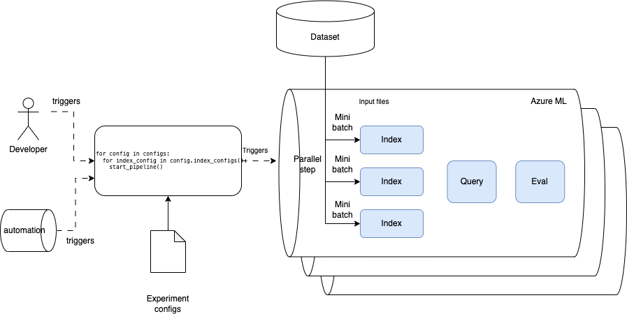
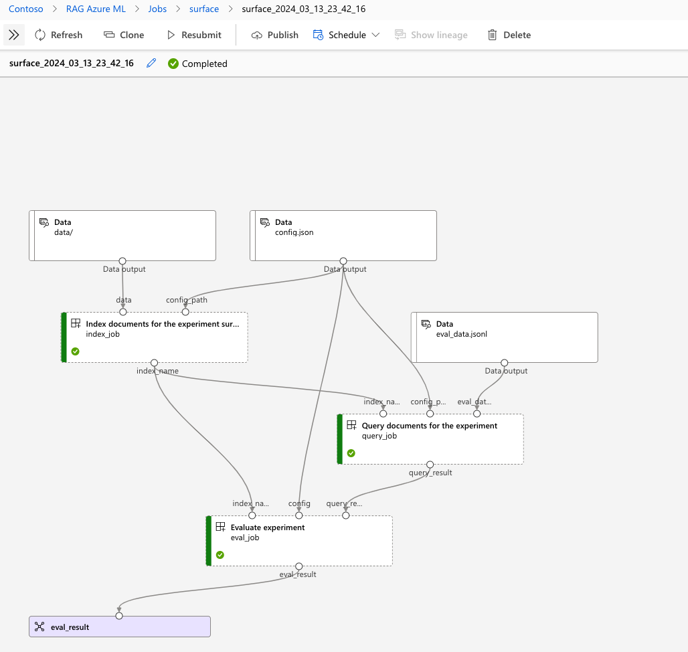
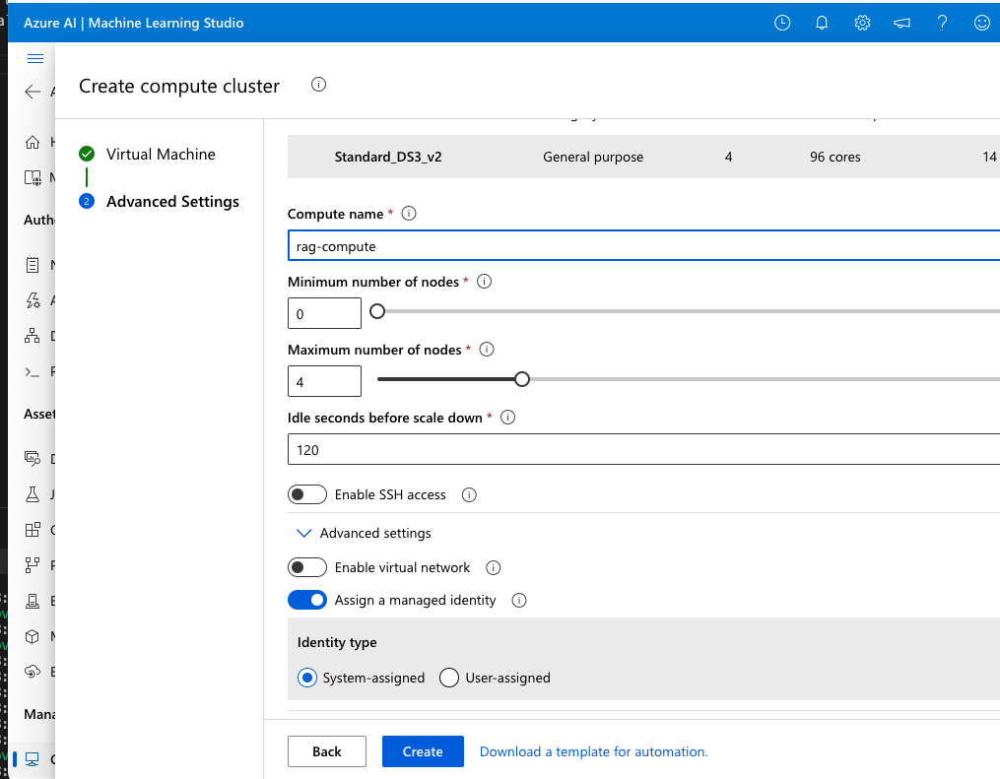
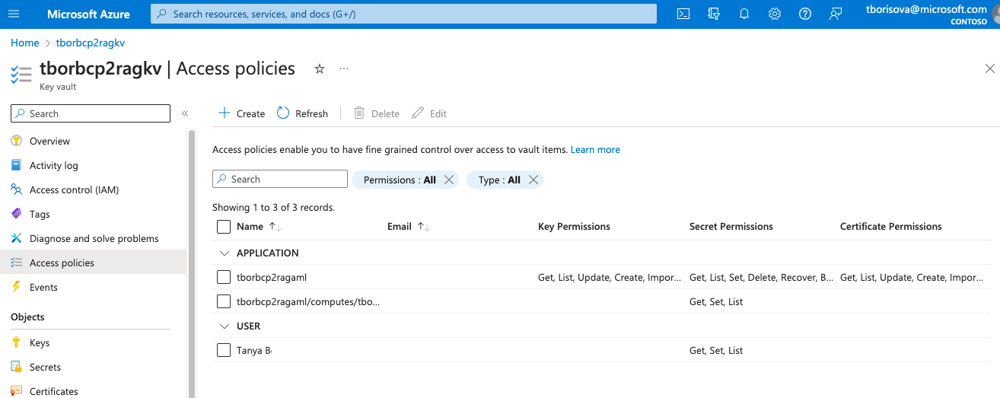
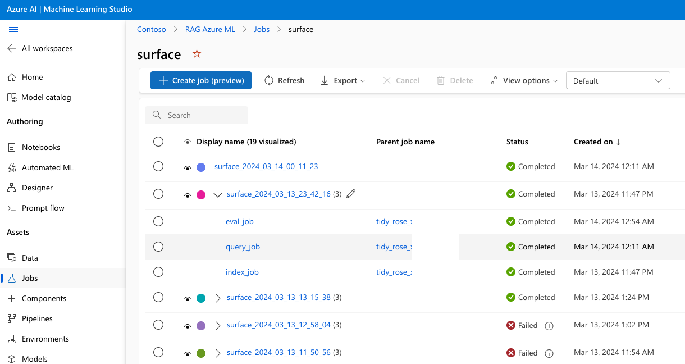
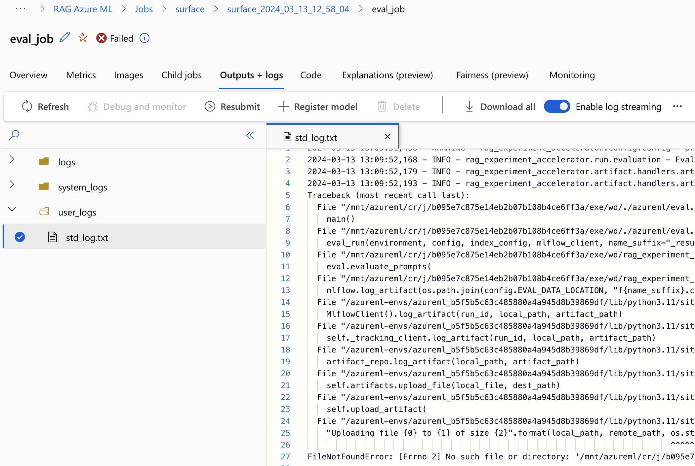
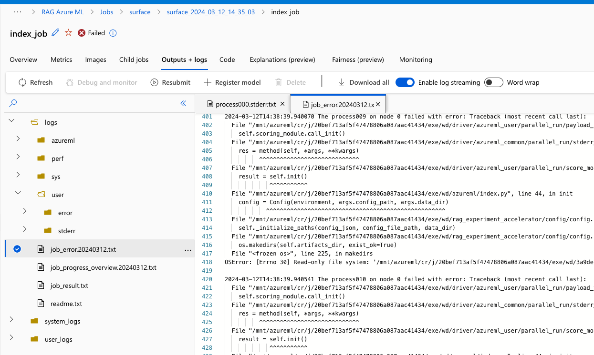

# AzureML Pipeline

## What is it

RAG Experiment Accelerator supports running the pipeline on Azure ML compute, in addition to running it on local machine. This document describes the steps to deploy the necessary resources on Azure, and to run the pipeline on Azure ML compute. 

## Architecture diagram





## Deploying the cloud resources 

To run the steps of RAG experiment accelerator on Azure ML compute, you will need perform the steps from [installation](../README.md#installation) section of the README file. This will take you through the setup to deploy all necessary Azure configuration for you.

After this, follow these steps to deploy additional resources to be able to run Azure ML pipeline:

1. Deploy an AML Compute cluster. In your Azure ML workspace, navigate to Compute -> Compute clusters, and click New. Pick the virtual machine required, give it a name, and set minimum and maximum number of nodes. It is recommended to set the minimum number of nodes to 0, so that the cluster can scale down to 0. In Advanced settings, assign a system-assigned managed identity.



2. When you created an Azure ML workspace, Azure will have created an associated keyvault for you. In the keyvault, create two Access Policies: one for yourself (or for the principal who is going to run the pipeline), and another one for the system-assigned managed identity created in the previous step. Both of these principals need Get, Set and List permissions on secrets.



3. Add the following environment variables to the .env file:

```bash
AML_COMPUTE_NAME=<name of the compute you have created>
AML_COMPUTE_INSTANCES_NUMBER=<maximum number of instances in the cluster>
AZURE_KEY_VAULT_ENDPOINT=<keyvault endpoint, e.g. https://<keyvault-name>.vault.azure.net>
```

4. Populate the keyvault with the environment configuration. To do so, run the script

```bash
python env_to_keyvault.py
```

This script assumes you already have a `.env` file populated with values. and will use this file to create a secret in the keyvault for each environment variable in the `.env` file.

## Configuring input for the pipeline

### Providing data input

Data input for the pipeline can be provided on the command line:

```bash
python azureml/pipeline.py --data_dir <path to data>
```

Or it can be provided in the config file:

```json
{
  "data_dir": "data input"
}
```

### Types of data input

The pipeline accepts input in formats understood by AzureML. For more information, see [docs on data inputs and outputs](https://learn.microsoft.com/en-us/azure/machine-learning/how-to-manage-inputs-outputs-pipeline?view=azureml-api-2&tabs=cli#path-and-mode-for-data-inputsoutputs).

This means that local file paths as input for the pipeline are supported. Additionally, you can create, for example, an AzureML Data Asset and provide a path to it as input for the pipeline:

```bash
python azureml/pipeline.py --data_dir azureml://<datastore-name>/<path-to-data>
```

## Running the pipeline

To run the pipeline, run the following command:

```bash
python azureml/pipeline.py
```

This will submit the pipeline to Azure ML compute, and you will be able to monitor the run in the Azure ML workspace.

On AzureML, head to your workspace and select Jobs on the left. Find the name for your experiment as defined by the name in the config. You will see all runs for your experiment. Click on the latest run to see the details of the run.



You also can visually compare the metrics for each run by using Dashboard tab. 

## Troubleshooting the pipeline

If the pipeline fails, you can check the logs of the run by clicking on the failed run, and then clicking on the logs tab. This will show you the logs for each step of the pipeline under `Outputs + logs` tab.



If the first step (the indexing step) of the pipeline fails, you may not be able to see the logs under that tab. You may need to look at the error logs for each individual compute instance or even each individual node.

