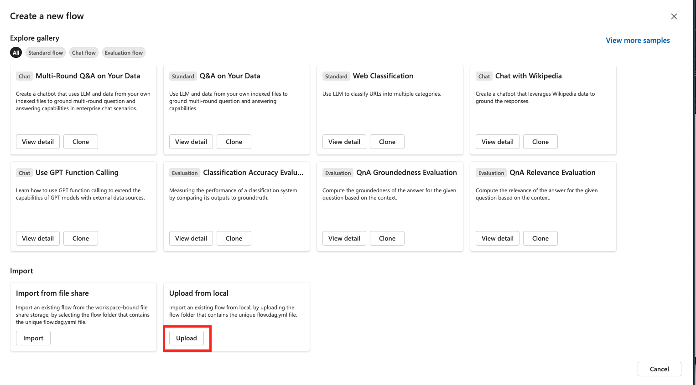

# **RAG Experiment Accelerator** with Prompt Flow

## Flow description

A standard flow that uses configuration to: 
- chunk documents
- create indexes 
- generate questions and answers for the documents
- query Azure AI Search using the RAG pattern
- evaluate the results against the generated answers

## Prerequisites
- [Azure AI Search Service](https://learn.microsoft.com/en-us/azure/search/search-create-service-portal) (Note: [Semantic Search](https://learn.microsoft.com/en-us/azure/search/search-get-started-semantic?tabs=dotnet) is available in Azure AI Search Service, at Basic tier or higher.)
- [Azure OpenAI Service](https://learn.microsoft.com/en-us/azure/ai-services/openai/overview#how-do-i-get-access-to-azure-openai)
- [Azure Machine Learning Resources](https://learn.microsoft.com/en-us/azure/machine-learning/tutorial-azure-ml-in-a-day?view=azureml-api-2)


## Getting Started

### VSCode
To run the **RAG Experiment Accelerator** end-to-end in VSCode, follow these steps:
1. Ensure you have installed the promptflow extension and pip installed the promptflow and promptflow-tools packages
2. Run: `pip install ./custom_environment/rag_experiment_accelerator-0.9-py3-none-any.whl` 
3. Create a custom connection. See [env_setup](./env_setup.md).
4. Add your own documents to the `./data` folder. (a set of sample documents are provided for testing purposes)
5. Modify the `config.json` file with the hyperparameters for your experiment. Full documentation on can be found [here](#description-of-configuration-elements)
6. Run the flow from the extension UI or from the CLI by running `pf flow test --flow ./flow.dag.yaml`
7. Inspect the results in your ML workspace by selecting the `Jobs` tab under `Assets`. Click on the latest experiment run to view the metrics and results.


### ML Workspace

To run the **RAG Experiment Accelerator** end-to-end in Prompt Flow, follow these steps:

1. Create a custom environment using the provided Dockerfile (this will take several minutes)
```bash
az login

az account set --subscription <subscription ID>

az extension add --name ml

az configure --defaults workspace=$MLWorkSpaceName group=$ResourceGroupName

cd ./custom_environment 

az ml environment create --file ./environment.yaml -w $MLWorkSpaceName
```
2. Create a custom runtime using the newly created environment. See [Create runtime in UI](https://learn.microsoft.com/en-us/azure/machine-learning/prompt-flow/how-to-create-manage-runtime?view=azureml-api-2#create-runtime-in-ui).
3. Modify the `config.json` file with the hyperparameters for your experiment. Full documentation on can be found [here](#description-of-configuration-elements)
4. Create a custom connection. See [env_setup](./env_setup.md).
4. Add your own documents to the `./data` folder. (a set of sample documents are provided for testing purposes)
5. Modify the `config.json` file with the hyperparameters for your experiment. Full documentation on can be found [here](#description-of-configuration-elements)
6. Upload the flow to the ML workspace 
7. Select the custom runtime in Prompt Flow
8. Click run in the UI
9. Inspect the results in your ML workspace by selecting the `Jobs` tab under `Assets`. Click on the latest experiment run to view the metrics and results.


## Description of configuration elements

```json
{
    "name_prefix": "Name of experiment, search index name used for tracking and comparing jobs",
    "chunking": {
        "chunk_size": "Size of each chunk e.g. [500, 1000, 2000]" ,
        "overlap_size": "Overlap Size for each chunk e.g. [100, 200, 300]" 
    },
    "embedding_dimension" : "embedding size for each chunk e.g. [384, 1024]. Valid values are 384, 768,1024" ,
    "ef_construction" : "ef_construction value determines the value of Azure Cognitive Search vector configuration." ,
    "ef_search":  "ef_search value determines the value of Azure Cognitive Search vector configuration.",
    "language": {
        "analyzer_name" : "name of the analyzer to use for the field. This option can be used only with searchable fields and it can't be set together with either searchAnalyzer or indexAnalyzer.",
        "index_analyzer_name" : "name of the analyzer used at indexing time for the field. This option can be used only with searchable fields. It must be set together with searchAnalyzer and it cannot be set together with the analyzer option.",
        "search_analyzer_name" : "name of the analyzer used at search time for the field. This option can be used only with searchable fields. It must be set together with indexAnalyzer and it cannot be set together with the analyzer option. This property cannot be set to the name of a language analyzer; use the analyzer property instead if you need a language analyzer.",
    },
    "rerank": "determines if search results should be re-ranked. Value values are TRUE or FALSE" ,
    "rerank_type": "determines the type of re-ranking. Value values are llm or crossencoder", 
    "llm_re_rank_threshold": "determines the threshold when using llm re-ranking. Chunks with rank above this number are selected in range from 1 - 10." ,
    "cross_encoder_at_k": "determines the threshold when using cross-encoding re-ranking. Chunks with given rank value are selected." ,
    "crossencoder_model" :"determines the model used for cross-encoding re-ranking step. Valid value is cross-encoder/stsb-roberta-base",
    "search_types" : "determines the search types used for experimentation. Valid value are search_for_match_semantic, search_for_match_Hybrid_multi, search_for_match_Hybrid_cross, search_for_match_text, search_for_match_pure_vector, search_for_match_pure_vector_multi, search_for_match_pure_vector_cross, search_for_manual_hybrid. e.g. ['search_for_manual_hybrid', 'search_for_match_Hybrid_multi','search_for_match_semantic' ]",
    "retrieve_num_of_documents": "determines the number of chunks to retrieve from the search index",
    "metric_types" : "determines the metrics used for evaluation purpose. Valid value are lcsstr, lcsseq, cosine, jaro_winkler, hamming, jaccard, levenshtein, fuzzy, bert_all_MiniLM_L6_v2, bert_base_nli_mean_tokens, bert_large_nli_mean_tokens, bert_large_nli_stsb_mean_tokens, bert_distilbert_base_nli_stsb_mean_tokens, bert_paraphrase_multilingual_MiniLM_L12_v2. e.g ['fuzzy','bert_all_MiniLM_L6_v2','cosine','bert_distilbert_base_nli_stsb_mean_tokens']",
    "chat_model_name":  "determines the OpenAI model",
    "embedding_model_name": "embedding model name",
    "openai_temperature": "determines the OpenAI temperature. Valid value ranges from 0 to 1.",
    "search_relevancy_threshold": "the similarity threshold to determine if a doc is relevant. Valid ranges are from 0.0 to 1.0"
}
```

# Folder structure

The top-level `flow.dag.yaml` runs the RAG experiments end-to-end using the five steps: 
    1. Setup (sets the necessary environment variables)
    2. Index 
        - chunks documents
        - creates indexes
        - generates a summary and title using an LLM
        - generate embeddings for the chunk content, title, and summary
        - uploads to the index 
    3. Question and answer generation
        - Chunks documents 
        - Generates a question and answer for each chunk
    4. Querying
        - Takes each generated question and queries Azure AI search based on the search methods defined in `config.json`
        - If the generated question is complex, the question is broken down into multiple questions and both questions are used in Azure AI Search
        - Optionally reranks the search results based on `config.json`
        - Adds the search content as context to the generated question and calls the LLM
        - the LLM response and search metrics are saved as a data asset to be used in the evaluation step
    5. Evaluation
        - evaluates the LLM response with the generated answer from step 3 using the metrics specified in `config.json`
        - logs the results to MLflow

Each step can also be run indepedently and the flow is contained in its correspinding folder. When runnning the flows independently, an inital `setup` will run to ensure the proper environment variables are set.

## Getting Started
To use the **RAG Experiment Accelerator** in Prompt Flow, follow these steps:
- 1. Modify the `config.json` file with the hyperparameters for your experiment. 
<!-- TODO: fix this - Full documentation on can be found [here](../README.md#description-of-configuration-elements) -->
- 2. Setup connection [add setup instruction here]

## Creating a custom environment for prompt flow runtime

```bash
az login

az account set --subscription <subscription ID>

az extension add --name ml

az configure --defaults workspace=$MLWorkSpaceName group=$ResourceGroupName

cd ./promptflow/rag-experiment-accelerator/custom_environment

az ml environment create --file ./environment.yaml -w $MLWorkSpaceName
```